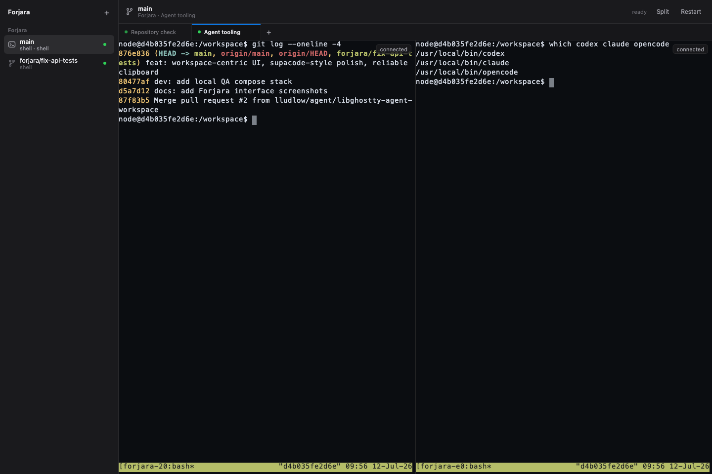
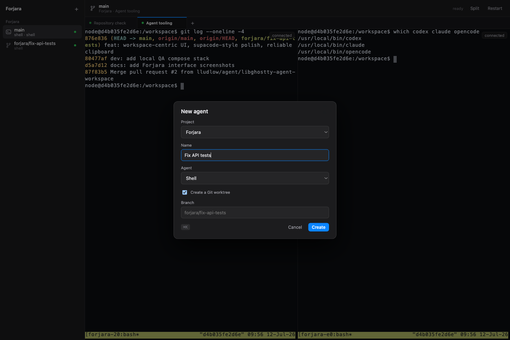

# Forjara — multi-agent coding workspaces on your tailnet

One container per workspace, each its own tailnet machine with a custom
libghostty-powered agent interface, optional web VS Code, and the AI coding
CLIs ready to run:

- `https://submind.<tailnet>.ts.net` → VS Code for *submind*
- `https://submind.<tailnet>.ts.net:8444` → Forjara agent workspace

Valid HTTPS certs, tailnet-only, nothing published on the LAN.

The Forjara interface discovers projects, creates persistent tmux sessions,
optionally creates Git worktrees, launches agents, and keeps multiple terminals
open in tabs or a split. Terminal parsing, screen state, and keyboard encoding
come from an official pinned `libghostty-vt.wasm` build; the server, renderer,
and workspace UI are Forjara code.

The sidebar lists **workspaces** — each project checkout plus one entry per
worktree — with the agents running inside and an attention dot. The tab bar
holds the terminals of the selected workspace: `+` (or `⌘K`) opens a new agent
there, `✕` stops one, and Split shows two side by side. Closing a workspace
stops its tabs and offers to remove its worktree; Git refuses to remove dirty
worktrees, and branches are always kept.



Above: the `main` workspace with two terminal tabs split side by side, and a
`forjara/fix-api-tests` worktree workspace ready in the sidebar. Every session
keeps running in tmux whether or not a browser is attached.

## What's in the image

`ghcr.io/lludlow/forjara` contains the Forjara web service, the official
[code-server release](https://github.com/coder/code-server/releases), tmux,
ripgrep, [mise](https://mise.jdx.dev) for per-project language runtimes, and:

| CLI | command |
|---|---|
| Claude Code | `claude` |
| OpenAI Codex | `codex` |
| Google Antigravity | `agy` (build with `GOOGLE_AGENT=gemini` for enterprise Gemini CLI) |
| opencode | `opencode` |

CLI logins persist in each project's `/config` volume — log in once per
project, survives container recreation.

## Quick start

Prereqs (one-time): [MagicDNS + HTTPS certs](https://tailscale.com/kb/1153/enabling-https)
enabled on your tailnet; a reusable auth key tagged `tag:forjara`.

```bash
git clone git@github.com:lludlow/Forjara.git && cd Forjara
cp config/tsdproxy.yaml.example config/tsdproxy.yaml   # paste your auth key
docker compose up -d
```

Open `https://submind.<tailnet>.ts.net:8444`, press **+** (or `⌘K`), then pick
the project, agent, and whether it should get an isolated Git worktree.



VS Code remains available at `https://submind.<tailnet>.ts.net`.

## Interface modes

Both interfaces are enabled by default. Set one environment variable before
starting Compose to run only one:

```bash
FORJARA_SERVICES=vscode docker compose up -d
FORJARA_SERVICES=web docker compose up -d
```

The disabled interface's port is unavailable. The supported values are
`vscode`, `web`, or `vscode,web`.

## Adding a project

Copy a workspace block in `docker-compose.yml`, change the service name, the
`tsdproxy.name` label, and the two volume lines, then `docker compose up -d`.
[tsdproxy](https://github.com/almeidapaulopt/tsdproxy) picks it up from the
labels and it appears on your tailnet.

## One or many projects per container

The default Compose example mounts one project at `/workspace`. To use a
container as a projects hub instead, mount the directory containing them:

```yaml
volumes:
  - workspace-config:/config
  - ${HOME}/projects:/workspace
```

When `/workspace` is a Git repository, Forjara treats it as one project. When
it is a directory of projects, immediate child directories appear separately;
plain folders work too.

Worktrees live under `<project>/.forjara/worktrees/` and are excluded through
the repository's local `.git/info/exclude`. Closing a tab never deletes a
worktree; closing a workspace asks first, runs `git worktree remove` without
`--force` so uncommitted work survives, and never deletes the branch.

## Project environments

The base image stays small on purpose — projects bring their own toolchains.
The repository owns its environment; Forjara owns the development experience.

Most projects need nothing but the pulled image and a `mise.toml`. In order
of how often you'll need them:

| Your project needs | Use | Build required? |
|---|---|---|
| Node (any version) | already in the image, corepack included | no |
| Go, Python, Rust, other runtimes | `mise.toml` in the repo | no |
| OS packages (native libs, browsers) | small project Dockerfile | seconds, on the host |
| PostgreSQL, Redis, etc. | Compose sidecar service | no |

### Language runtimes via mise (the default — no build)

[mise](https://mise.jdx.dev) is preinstalled in the image. Drop a `mise.toml`
in the repo declaring what the project needs:

```toml
# a Go project
[tools]
go = "1.22"
```

```toml
# a Python project using uv
[tools]
python = "3.12"
uv = "latest"
```

Then, once, in any terminal tab of that project:

```bash
mise trust && mise install
```

That's it — `go`, `python`, `uv` now resolve in every terminal and agent
session, pinned to the project's versions. Runtimes install under `/config`,
so they survive container recreation; you never rebuild or restart anything.

Node projects usually need no `mise.toml` at all: the image ships Node 22
with corepack enabled, so a `"packageManager": "pnpm@10.x"` pin in
package.json resolves by itself on first `pnpm` run.

### OS packages: derive a project image

mise installs language runtimes, not apt packages. If the project needs
native libraries, database *client* tools, or Playwright's browser
dependencies, give it a small Dockerfile — `.forjara/Dockerfile` in the repo:

```dockerfile
FROM ghcr.io/lludlow/forjara:latest
USER root
RUN apt-get update && apt-get install -y --no-install-recommends \
      postgresql-client libvips-dev \
 && rm -rf /var/lib/apt/lists/*
USER node
```

and its workspace block uses `build:` with its own image tag — the complete
service is in [docker-compose.derived.example.yml](docker-compose.derived.example.yml).
This is not "building Forjara" — it's an apt layer on top of the pulled base
image, built in seconds by the same `docker compose up -d`. Entrypoint,
agents, code-server, mise, and `/config` persistence are all inherited.

### Service sidecars

A project that needs PostgreSQL, Redis, or similar gets them as extra Compose
services next to its workspace block — same network, reachable by service
name:

```yaml
  atlas-db:
    image: postgres:17
    restart: unless-stopped
    environment:
      POSTGRES_PASSWORD: dev
    volumes:
      - atlas-db-data:/var/lib/postgresql/data
```

Inside the atlas workspace, the database is simply `atlas-db:5432`. The host
manages sidecars; the workspace never gets the Docker socket.

### Already have a compose file? Add Forjara to it

It also works the other way around: if your project already has a
`docker-compose.yml` with its app and services, add one service to it instead
of adopting Forjara's:

```yaml
# your existing docker-compose.yml
services:
  db:
    image: postgres:17
    # ...

  forjara:
    image: ghcr.io/lludlow/forjara:latest
    restart: unless-stopped
    ports:
      - "127.0.0.1:8080:8080"   # Forjara UI  -> http://localhost:8080
      - "127.0.0.1:8443:8443"   # VS Code     -> http://localhost:8443
    volumes:
      - forjara-config:/config
      - .:/workspace

volumes:
  forjara-config:
```

`docker compose up -d` and the workspace is live, on the same network as the
rest of your stack — your existing `db` service is already its sidecar,
reachable as `db:5432`. For tailnet access instead of localhost ports, drop
the `ports:` block and add the tsdproxy labels from the main example. The
same security notes apply: this container runs coding agents with your
credentials, so don't publish its ports beyond localhost or your tailnet.

### Running and previewing a web app

Start the dev server in any terminal tab — tmux keeps it running when the
browser disconnects. With the `vscode` service enabled, code-server proxies
any local port over the existing tailnet hostname:

```text
https://atlas.<tailnet>.ts.net/proxy/5173/
```

Apps that can't tolerate the path prefix can use `/absproxy/<port>/` instead —
see the [code-server proxy docs](https://github.com/coder/code-server/blob/main/docs/guide.md#accessing-web-services).

Tests are the project's own commands — `go test ./...`, `pnpm test`, `pytest`
— run in a tab like anything else. Forjara deliberately has no test-harness
abstraction or language detection.

## Agent attention signals

Agent sessions receive `FORJARA_SESSION_ID` and `FORJARA_EVENT_SOCKET`.
Integrations can update the sidebar without parsing terminal output:

```bash
forjara-web signal busy
forjara-web signal awaiting_input
forjara-web signal idle
forjara-web signal notification
```

Forjara reports agent process start and exit automatically. Agent-specific
hooks may invoke the commands above; they are delivered over a private Unix
socket and streamed to open browsers.

## Security notes

- Keep Tailscale Funnel off — these containers hold live Anthropic/OpenAI/
  Google credentials.
- Never mount `/var/run/docker.sock`, `~/.ssh`, `~/.aws`, or host `/home`
  into a workspace. (tsdproxy holds the socket; the workspaces never do.)
- Scope the auth key with a `tag:forjara` ACL.
- Running agents unsupervised? Add an egress firewall — see
  [Anthropic's devcontainer reference](https://code.claude.com/docs/en/devcontainer).
